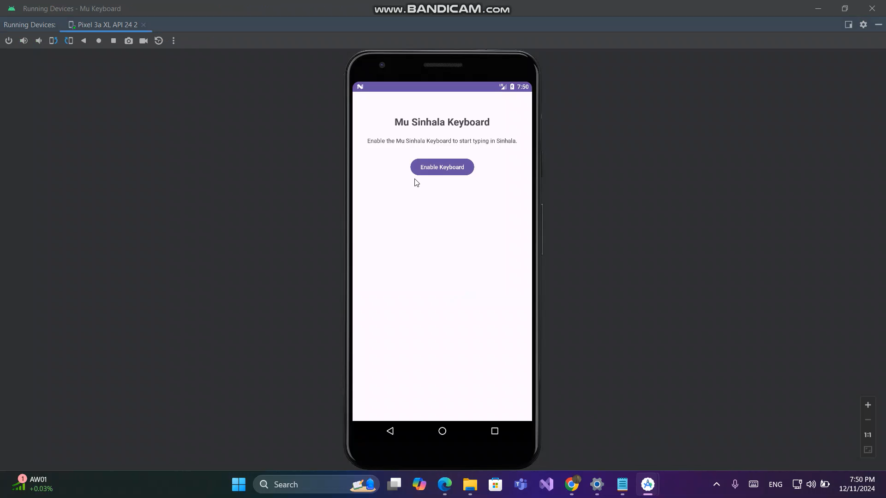
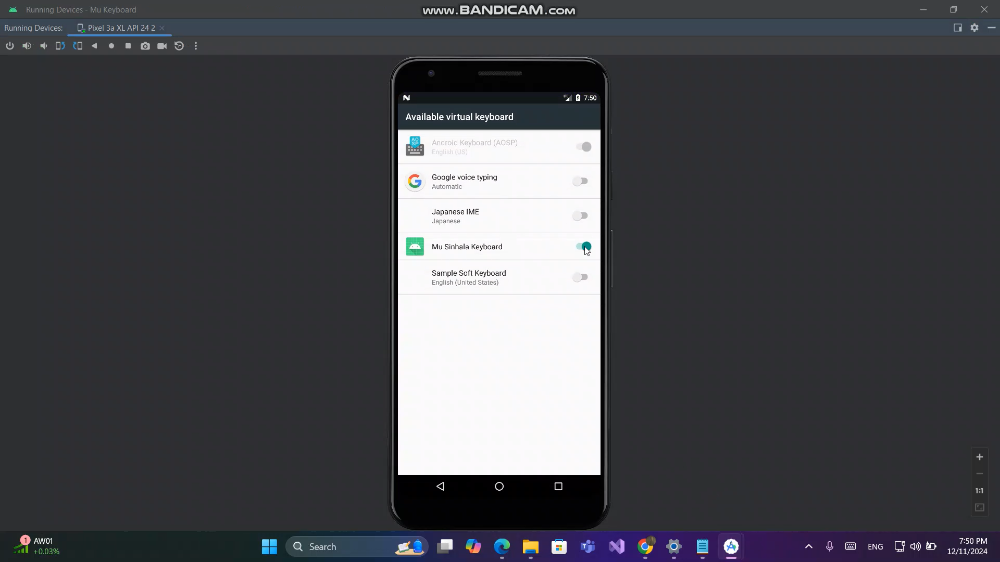
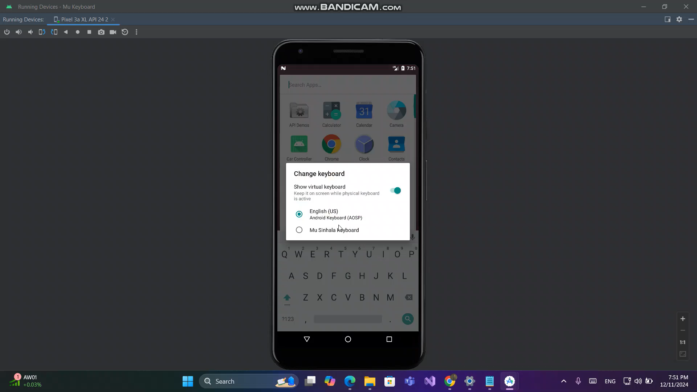
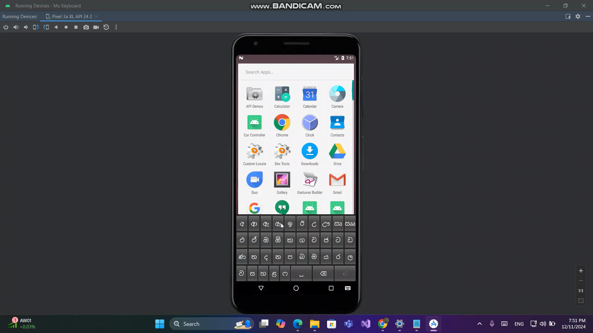

# ✨ Mu Keyboard ✨

**Mu Keyboard** by **Mu Company** is a user-friendly Sinhala language keyboard app designed for Android devices. It provides an efficient and seamless typing experience for Sinhala-speaking users.

---

## 🛠️ Features

- 🇱 Full Sinhala character set, symbols, and punctuation marks.
- 💳 Quick access to essential keys like backspace and enter.
- 🛏️ Smooth integration with any Android app.
- 🔦 Easy-to-use design for effortless typing.

---

## 👍 How to Use

- Open any app that requires typing (e.g., Messages, WhatsApp).
- When the keyboard appears, select **Mu Keyboard**.
- Start typing in Sinhala with ease!

---

## 📊 About the App

- **App Name:** Mu Keyboard  
- **Developed by:** Mu Company  
- **Platform:** Android  
- **Language:** Sinhala

---

## 📷 Screensort
   

---

## 🌟 Why Choose Mu Keyboard?

Mu Keyboard makes Sinhala typing easy and accessible with its intuitive design and complete character set. Whether you're chatting, posting on social media, or writing notes, Mu Keyboard ensures a smooth and productive experience.

---

🌐 **Stay Connected:**  
For updates and support, visit our website or contact us via email.

✨ *Happy Typing with Mu Keyboard!* ✨
